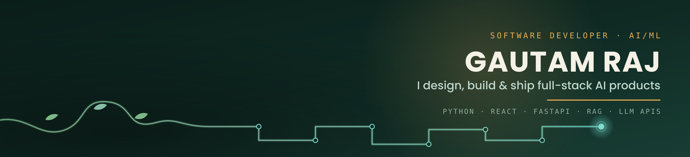

 

 

### About Me

I'm a final-year **B.Tech CSE (AI)** student who doesn't just study AI — I ship it. I independently design, build, and deploy full-stack AI products end-to-end: computer vision pipelines, RAG systems, and LLM-powered assistants, wired into real backends with auth, databases, and CI/CD, and pushed live.

- 🔭 Currently building **PlantSathi AI** and **SmartHire** — both live in production
- 🌱 Exploring RAG architectures, vector search, and multi-model AI pipelines
- 🎓 Final-year CSE (AI) @ Motihari College of Engineering (CGPA 8.16)
- 💬 Ask me about FastAPI, RAG pipelines, or debugging a silent JWT bug at 2 AM
- 📫 **gp832008@gmail.com**

 

### Featured Projects

<table>
<tr>
<td width="50%" valign="top">

**🌱 [PlantSathi AI](https://github.com/GautamRaj1234/plantsathi-ai)**
Full-stack plant-health platform combining computer vision (species ID + disease classification), an LLM-powered conversational assistant, and live weather data for context-aware care advice.

`React` `Node.js` `Express` `JWT` `PlantNet API` `Hugging Face` `Groq Llama 3.1`

[Live demo →](https://plantsathi-ai.vercel.app)

</td>
<td width="50%" valign="top">

**🎯 [SmartHire](https://github.com/GautamRaj1234/smarthire)**
RAG-based resume-screening SaaS. Hybrid matching engine (Gemini embeddings + ChromaDB semantic search + keyword ATS scoring) with a recruiter dashboard and AI-generated candidate analysis.

`FastAPI` `React` `ChromaDB` `Gemini API` `Docker` `JWT`

[Live demo →](https://frontend-oliveone-16.vercel.app)

</td>
</tr>
</table>

 

### Tech Stack

**Languages**
 

**AI / ML**
 

**Backend & Frontend**
 

**Databases & DevOps**
 

 

### GitHub Stats

 

### Let's Connect

